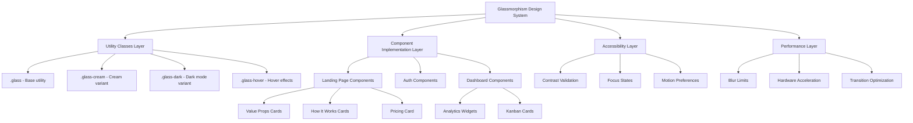

# Design Document: Glassmorphism Design System

## Overview

The glassmorphism design system will transform CarePilot's visual interface by implementing a comprehensive "frosted glass" aesthetic across all components. This design leverages transparency, backdrop blur effects, subtle borders, and refined shadows to create depth and visual hierarchy while maintaining the application's distinctive Sky Blue and Cream Yellow color palette.

The implementation will be built on Tailwind CSS v4, requiring specific syntax patterns (RGB with opacity, no @apply directive). The system will provide reusable utility classes in globals.css and apply them consistently across landing page components, authentication forms, and dashboard widgets.

Key design principles:
- **Consistency**: Unified glassmorphism patterns across all components
- **Performance**: Optimized blur effects and hardware-accelerated animations
- **Accessibility**: WCAG AA compliant contrast ratios and motion sensitivity support
- **Responsiveness**: Seamless experience across all device sizes
- **Maintainability**: Reusable utility classes that simplify future development

## Architecture

### System Components



### Design Layers

1. **Utility Classes Layer**: Core reusable CSS classes defined in globals.css that encapsulate glassmorphism patterns
2. **Component Implementation Layer**: Application of utility classes to specific components across landing, auth, and dashboard areas
3. **Accessibility Layer**: Contrast validation, focus states, and motion sensitivity handling
4. **Performance Layer**: Blur optimization, hardware acceleration, and efficient transitions

### Color System Integration

The glassmorphism system integrates with CarePilot's existing color palette:

- **Sky Blue (#aee4ff)**: Background color, used at various opacity levels
- **Cream Yellow (#fff8d7)**: Card backgrounds, primary glassmorphism surface
- **Primary Blue (#0097b2)**: Text, borders, and accents
- **Opacity Ranges**: 40%-70% for different visual hierarchy levels
- **Border Opacity**: 10%-20% for subtle separation

## Components and Interfaces

### Utility Classes Structure

#### Base Glass Utility (.glass)

```css
.glass {
  background-color: rgb(255 248 215 / 0.6); /* Cream Yellow at 60% */
  backdrop-filter: blur(8px); /* Medium blur */
  -webkit-backdrop-filter: blur(8px); /* Safari support */
  border: 1px solid rgb(0 151 178 / 0.1); /* Primary at 10% */
  box-shadow: 0 8px 32px 0 rgb(0 151 178 / 0.08);
  transition: all 300ms ease-in-out;
}
```

#### Cream Variant (.glass-cream)

```css
.glass-cream {
  background-color: rgb(255 248 215 / 0.6);
  backdrop-filter: blur(8px);
  -webkit-backdrop-filter: blur(8px);
  border: 1px solid rgb(0 151 178 / 0.1);
  box-shadow: 0 8px 30px rgb(0 151 178 / 0.08);
}
```

#### Dark Mode Variant (.glass-dark)

```css
.dark .glass-dark {
  background-color: rgb(0 77 109 / 0.7); /* Darker blue at 70% */
  backdrop-filter: blur(12px);
  -webkit-backdrop-filter: blur(12px);
  border: 1px solid rgb(174 228 255 / 0.15);
  box-shadow: 0 8px 32px 0 rgb(0 0 0 / 0.3);
}
```

#### Hover Effects (.glass-hover)

```css
.glass-hover:hover {
  background-color: rgb(255 248 215 / 0.7); /* Increase to 70% */
  transform: translateY(-2px);
  box-shadow: 0 12px 40px 0 rgb(0 151 178 / 0.12);
}
```

### Component Implementation Patterns

#### Landing Page Value Props Cards

**Current State:**
```tsx
<Card className="glass-cream glass-hover border-border/40">
```

**Enhanced State:**
```tsx
<Card className="bg-card/60 backdrop-blur-md border border-primary/10 shadow-lg hover:bg-card/70 hover:-translate-y-1 hover:shadow-xl transition-all duration-300">
```

**Rationale**: Inline Tailwind classes provide more flexibility and are compatible with Tailwind v4 syntax. The pattern uses:
- `bg-card/60`: 60% opacity cream background
- `backdrop-blur-md`: 8px blur effect
- `border border-primary/10`: Subtle border at 10% opacity
- `shadow-lg`: Soft shadow for depth
- Hover states: Increase opacity, lift, and enhance shadow

#### How It Works Cards

**Current State:**
```tsx
<div className="glass-cream p-8 rounded-[2.5rem] border-2 border-primary/10 ...">
```

**Enhanced State:**
```tsx
<div className="bg-[#fff8d7]/70 backdrop-blur-md p-8 rounded-[2.5rem] border-2 border-primary/10 shadow-[0_8px_30px_rgb(0,151,178,0.08)] hover:backdrop-blur-lg hover:-translate-y-1 transition-all duration-300">
```

**Rationale**: Higher opacity (70%) for better content visibility, with enhanced blur on hover for premium feel.

#### Pricing Card

**Current State:**
```tsx
<Card className="glass-cream border-2 border-primary/20 ...">
```

**Enhanced State:**
```tsx
<Card className="bg-[#fff8d7]/60 backdrop-blur-lg border-2 border-primary/20 shadow-[0_8px_30px_rgb(0,151,178,0.08)] hover:backdrop-blur-xl hover:shadow-[0_12px_40px_rgb(0,151,178,0.12)] transition-all duration-300">
```

**Rationale**: Larger blur (16px) for premium appearance, enhanced shadow on hover to draw attention.

#### Auth Form

**Current State:**
```tsx
<Card className="border-border/50 bg-card/70 backdrop-blur">
```

**Enhanced State:**
```tsx
<Card className="bg-card/70 backdrop-blur-md border border-white/20 shadow-xl hover:bg-card/75 transition-all duration-300">
```

**Rationale**: Refined border with white/20 for subtle separation, subtle hover feedback for polish.

#### Dashboard Analytics Cards

**Current State:**
```tsx
<Card className="bg-background/80 border-border/50">
```

**Enhanced State:**
```tsx
<Card className="bg-card/60 backdrop-blur-md border border-primary/10 shadow-lg">
```

**Rationale**: Consistent glassmorphism treatment matching landing page patterns.

#### Dashboard Kanban Cards

**Current State:**
```tsx
<Card className="bg-background/80 border-border/50">
```

**Enhanced State:**
```tsx
<Card className="bg-card/60 backdrop-blur-md border border-primary/10 shadow-lg hover:bg-card/70 hover:-translate-y-0.5 transition-all duration-300">
```

**Rationale**: Subtle hover lift (0.5px) for interactive feedback without being distracting.

## Data Models

### Glassmorphism Configuration Model

```typescript
interface GlassmorphismConfig {
  // Background opacity levels
  opacity: {
    light: 0.4;    // 40% - Very transparent
    medium: 0.5;   // 50% - Balanced
    standard: 0.6; // 60% - Default
    strong: 0.7;   // 70% - More opaque
  };
  
  // Blur intensity levels
  blur: {
    sm: '4px';     // Subtle blur
    md: '8px';     // Medium blur (default)
    lg: '16px';    // Strong blur
    xl: '24px';    // Maximum blur (use sparingly)
  };
  
  // Border opacity levels
  borderOpacity: {
    subtle: 0.1;   // 10% - Very subtle
    standard: 0.15; // 15% - Balanced
    visible: 0.2;  // 20% - More prominent
  };
  
  // Shadow configurations
  shadows: {
    soft: '0 8px 30px rgb(0 151 178 / 0.08)';
    medium: '0 8px 32px 0 rgb(0 151 178 / 0.1)';
    strong: '0 12px 40px 0 rgb(0 151 178 / 0.12)';
  };
  
  // Hover transform values
  transforms: {
    subtle: 'translateY(-0.5px)';  // Minimal lift
    standard: 'translateY(-2px)';  // Default lift
    prominent: 'translateY(-4px)'; // Strong lift
  };
  
  // Transition timing
  transitions: {
    duration: '300ms';
    easing: 'ease-in-out';
  };
}
```

### Component Styling Model

```typescript
interface ComponentGlassStyle {
  // Component identifier
  component: 'value-card' | 'how-it-works-card' | 'pricing-card' | 'auth-form' | 'analytics-card' | 'kanban-card';
  
  // Base styling
  base: {
    backgroundColor: string;  // RGB with opacity
    backdropBlur: string;     // Blur value
    border: string;           // Border with opacity
    shadow: string;           // Box shadow
  };
  
  // Hover styling
  hover?: {
    backgroundColor?: string;
    backdropBlur?: string;
    transform?: string;
    shadow?: string;
  };
  
  // Dark mode overrides
  dark?: {
    backgroundColor: string;
    border: string;
    shadow: string;
  };
  
  // Accessibility considerations
  accessibility: {
    minContrastRatio: number;  // WCAG AA = 4.5
    focusVisible: boolean;
    reducedMotion: boolean;
  };
}
```

### Color Palette Model

```typescript
interface ColorPalette {
  // Light mode colors
  light: {
    skyBlue: {
      hex: '#aee4ff';
      rgb: 'rgb(174 228 255)';
    };
    creamYellow: {
      hex: '#fff8d7';
      rgb: 'rgb(255 248 215)';
    };
    primaryBlue: {
      hex: '#0097b2';
      rgb: 'rgb(0 151 178)';
    };
  };
  
  // Dark mode colors
  dark: {
    darkBlue: {
      hex: '#003d5c';
      rgb: 'rgb(0 61 92)';
    };
    mediumBlue: {
      hex: '#004d6d';
      rgb: 'rgb(0 77 109)';
    };
    lightBlue: {
      hex: '#aee4ff';
      rgb: 'rgb(174 228 255)';
    };
  };
}
```

## Correctness Properties

*A property is a characteristic or behavior that should hold true across all valid executions of a system—essentially, a formal statement about what the system should do. Properties serve as the bridge between human-readable specifications and machine-verifiable correctness guarantees.*

Before defining the correctness properties, let me analyze the acceptance criteria for testability:


### Property Reflection

After analyzing all acceptance criteria, I've identified the following patterns for consolidation:

**Redundancy Analysis:**

1. **CSS Class Structure Properties (1.1-1.4)**: These can be combined into a single property that verifies all utility classes have the required structure.

2. **Component Styling Properties (2.1-2.2, 3.1-3.2, 4.1-4.2, 5.1-5.2, 6.1-6.2, 7.1-7.2)**: All these verify that components have glassmorphism styling with opacity, blur, and borders. These can be combined into one property that checks any component has the correct pattern.

3. **Hover Effect Properties (2.3-2.5, 3.3-3.4, 4.3-4.4, 5.3, 12.1-12.3)**: These all verify hover effects follow consistent patterns. Can be combined into one property about hover consistency.

4. **Contrast Ratio Properties (8.1, 8.5, 10.3)**: These all verify WCAG AA compliance. Can be combined into one property that works for both light and dark modes.

5. **Background Replacement Properties (6.4, 7.4)**: Both verify that old solid backgrounds are replaced with glassmorphism. Can be combined.

6. **Dark Mode Properties (10.2, 10.4)**: Both verify dark mode variants exist. Can be combined.

**Consolidated Properties:**

After reflection, I'll create properties that:
- Verify CSS utility class structure (combines 1.1-1.4)
- Verify Tailwind v4 syntax compliance (1.5, 1.6)
- Verify component glassmorphism styling (combines 2.1-2.2, 3.1-3.2, 4.1-4.2, 5.1-5.2, 6.1-6.2, 7.1-7.2)
- Verify hover effect consistency (combines 2.3-2.6, 3.3-3.4, 4.3-4.4, 5.3, 12.1-12.4)
- Verify accessibility compliance (combines 8.1, 8.5, 10.3)
- Verify performance optimizations (9.1-9.4)
- Verify dark mode support (combines 10.2, 10.4)
- Verify interactive element patterns (8.2, 11.2, 12.5)

### Correctness Properties

Property 1: Utility Class Structure Completeness
*For any* glassmorphism utility class (.glass, .glass-cream, .glass-dark, .glass-hover), the CSS definition should contain all required properties: background-color with opacity, backdrop-filter with blur value, border with opacity, and box-shadow.
**Validates: Requirements 1.1, 1.2, 1.3, 1.4**

Property 2: Tailwind v4 Syntax Compliance
*For any* color value in the glassmorphism CSS, the color should use RGB format with opacity (e.g., rgb(255 248 215 / 0.6)) and the file should not contain any @apply directives.
**Validates: Requirements 1.5, 1.6**

Property 3: Component Glassmorphism Styling
*For any* component that should have glassmorphism (value cards, how-it-works cards, pricing card, auth form, analytics cards, kanban cards), the className should include background opacity (/40 to /70), backdrop-blur (md or lg), and border with primary color opacity (/10 or /20).
**Validates: Requirements 2.1, 2.2, 3.1, 3.2, 4.1, 4.2, 5.1, 5.2, 6.1, 6.2, 7.1, 7.2**

Property 4: Hover Effect Consistency
*For any* interactive glassmorphism component, the hover state should include exactly three enhancements: increased opacity (e.g., /60 to /70), upward transform (-translate-y), and enhanced shadow, all with transition-all duration-300.
**Validates: Requirements 2.3, 2.4, 2.5, 2.6, 3.3, 3.4, 4.3, 4.4, 5.3, 12.1, 12.2, 12.3, 12.4**

Property 5: Accessibility Contrast Compliance
*For any* text element on a glassmorphism background, the contrast ratio between the text color and the effective background color (considering opacity and blur) should meet or exceed WCAG AA standard of 4.5:1 in both light and dark modes.
**Validates: Requirements 8.1, 8.5, 10.3**

Property 6: Blur Performance Limits
*For any* backdrop-blur value in the design system, the blur radius should not exceed 16px (backdrop-blur-lg), ensuring values are limited to blur-sm (4px), blur-md (8px), or blur-lg (16px).
**Validates: Requirements 9.1**

Property 7: Hardware Acceleration Optimization
*For any* element with hover transforms, the CSS should include will-change: backdrop-filter or will-change: transform to enable hardware acceleration, and animations should only use transform and opacity properties.
**Validates: Requirements 9.2, 9.4**

Property 8: Reduced Motion Support
*For any* animated glassmorphism element, the CSS should include a @media (prefers-reduced-motion: reduce) rule that disables or reduces the animation.
**Validates: Requirements 9.3**

Property 9: Dark Mode Variant Completeness
*For any* glassmorphism utility class, there should exist a corresponding dark mode variant (.dark .glass*) with adjusted background colors, border colors, and opacity values.
**Validates: Requirements 10.2, 10.4**

Property 10: Interactive Element Focus States
*For any* interactive element with glassmorphism styling, the className should include focus-visible styles or the component should have explicit focus state handling.
**Validates: Requirements 8.2**

Property 11: Touch Target Accessibility
*For any* interactive element on mobile viewports, the element should have minimum dimensions of 44x44 pixels to meet touch target accessibility standards.
**Validates: Requirements 11.2**

Property 12: Non-Interactive Element Hover Exclusion
*For any* non-interactive element (elements without onClick, href, button role, etc.) with glassmorphism styling, the className should not include hover: state modifiers.
**Validates: Requirements 12.5**

Property 13: Empty State Glassmorphism
*For any* empty state card in the kanban view, the className should include border-dashed along with standard glassmorphism properties (opacity, blur, border).
**Validates: Requirements 7.3**

Property 14: Background Replacement Completeness
*For any* dashboard component (analytics or kanban), the className should not contain bg-background/80 and should instead use bg-card/60 with backdrop-blur-md.
**Validates: Requirements 6.4, 7.4**

## Error Handling

### CSS Parsing Errors

**Scenario**: Invalid CSS syntax in utility class definitions
**Handling**: 
- Validate CSS syntax before deployment using PostCSS
- Provide clear error messages indicating which utility class has invalid syntax
- Fall back to solid backgrounds if glassmorphism CSS fails to load

### Browser Compatibility Issues

**Scenario**: Browser doesn't support backdrop-filter
**Handling**:
- Include -webkit-backdrop-filter prefix for Safari support
- Provide fallback with increased opacity (e.g., /80 instead of /60) for browsers without backdrop-filter support
- Use @supports rule to detect backdrop-filter support

```css
@supports (backdrop-filter: blur(8px)) or (-webkit-backdrop-filter: blur(8px)) {
  .glass {
    /* Glassmorphism styles */
  }
}

@supports not (backdrop-filter: blur(8px)) and not (-webkit-backdrop-filter: blur(8px)) {
  .glass {
    /* Fallback with higher opacity */
    background-color: rgb(255 248 215 / 0.85);
  }
}
```

### Contrast Ratio Failures

**Scenario**: Text contrast ratio falls below WCAG AA standard
**Handling**:
- Increase background opacity to improve contrast
- Adjust text color to darker shade
- Add text-shadow for additional contrast if needed
- Document minimum opacity values required for each text color

### Performance Degradation

**Scenario**: Blur effects cause lag on low-end devices
**Handling**:
- Detect device capabilities using matchMedia for prefers-reduced-motion
- Reduce blur intensity on mobile devices (use blur-sm instead of blur-md)
- Disable blur effects entirely if frame rate drops below 30fps
- Provide user preference toggle to disable glassmorphism effects

### Dark Mode Transition Issues

**Scenario**: Jarring visual changes when toggling dark mode
**Handling**:
- Add transition: background-color 300ms, border-color 300ms to all glassmorphism elements
- Ensure dark mode colors are defined for all utility classes
- Test transition smoothness across all components

## Testing Strategy

### Dual Testing Approach

This feature requires both unit tests and property-based tests to ensure comprehensive coverage:

**Unit Tests**: Focus on specific examples, edge cases, and integration points
- Verify specific CSS class definitions exist with correct values
- Test individual component className strings
- Verify dark mode variants are applied correctly
- Test browser compatibility fallbacks
- Verify accessibility features like focus states

**Property-Based Tests**: Verify universal properties across all inputs
- Generate random component configurations and verify glassmorphism patterns
- Generate random color combinations and verify contrast ratios
- Generate random blur values and verify they don't exceed limits
- Test hover effect consistency across all interactive elements

### Property-Based Testing Configuration

**Library**: Use `fast-check` for TypeScript/JavaScript property-based testing

**Configuration**:
- Minimum 100 iterations per property test
- Each test must reference its design document property
- Tag format: `Feature: glassmorphism-design-system, Property {number}: {property_text}`

### Test Categories

#### 1. CSS Structure Tests (Unit + Property)

**Unit Tests**:
- Verify .glass utility class exists in globals.css
- Verify .glass-cream utility class exists with correct color
- Verify .glass-dark utility class exists with dark mode selector
- Verify .glass-hover utility class exists with hover pseudo-class
- Verify no @apply directives exist in globals.css

**Property Tests**:
- Property 1: For any utility class, verify complete structure
- Property 2: For any color value, verify Tailwind v4 syntax

#### 2. Component Styling Tests (Unit + Property)

**Unit Tests**:
- Verify value prop cards have bg-card/60 backdrop-blur-md
- Verify how-it-works cards have bg-[#fff8d7]/70 backdrop-blur-md
- Verify pricing card has bg-[#fff8d7]/60 backdrop-blur-lg
- Verify auth form has bg-card/70 backdrop-blur-md
- Verify analytics cards have bg-card/60 backdrop-blur-md
- Verify kanban cards have bg-card/60 backdrop-blur-md

**Property Tests**:
- Property 3: For any component, verify glassmorphism pattern
- Property 14: For any dashboard component, verify background replacement

#### 3. Hover Effect Tests (Unit + Property)

**Unit Tests**:
- Verify value prop cards have hover:bg-card/70 hover:-translate-y-1
- Verify how-it-works cards have hover:backdrop-blur-lg hover:-translate-y-1
- Verify pricing card has hover:backdrop-blur-xl hover:shadow-enhanced
- Verify auth form has hover:bg-card/75
- Verify kanban cards have hover:bg-card/70 hover:-translate-y-0.5

**Property Tests**:
- Property 4: For any interactive component, verify hover consistency
- Property 12: For any non-interactive element, verify no hover effects

#### 4. Accessibility Tests (Unit + Property)

**Unit Tests**:
- Verify primary text on cream background meets 4.5:1 contrast
- Verify primary text on sky blue background meets 4.5:1 contrast
- Verify white text on primary blue background meets 4.5:1 contrast
- Verify dark mode text contrasts meet 4.5:1
- Verify interactive elements have focus-visible styles

**Property Tests**:
- Property 5: For any text/background combination, verify contrast ratio
- Property 10: For any interactive element, verify focus states
- Property 11: For any interactive element, verify touch target size

#### 5. Performance Tests (Unit + Property)

**Unit Tests**:
- Verify backdrop-blur-sm is 4px
- Verify backdrop-blur-md is 8px
- Verify backdrop-blur-lg is 16px
- Verify no blur values exceed 16px
- Verify prefers-reduced-motion media query exists

**Property Tests**:
- Property 6: For any blur value, verify performance limits
- Property 7: For any animated element, verify hardware acceleration
- Property 8: For any animated element, verify reduced motion support

#### 6. Dark Mode Tests (Unit + Property)

**Unit Tests**:
- Verify .dark .glass-dark exists
- Verify dark mode uses rgb(0 77 109 / 0.7)
- Verify dark mode borders use rgb(174 228 255 / 0.15)
- Verify dark mode shadows are defined

**Property Tests**:
- Property 9: For any utility class, verify dark mode variant exists

#### 7. Edge Case Tests (Unit)

- Empty kanban columns with dashed borders (Property 13)
- Very long text content in glassmorphism cards
- Nested glassmorphism elements
- Glassmorphism on different background colors
- Mobile viewport rendering (320px width)
- Large viewport rendering (1920px width)

### Testing Tools

- **Jest**: Unit test runner
- **fast-check**: Property-based testing library
- **Testing Library**: Component testing utilities
- **axe-core**: Accessibility testing
- **PostCSS**: CSS validation
- **Playwright**: Browser compatibility testing

### Continuous Integration

- Run all tests on every pull request
- Fail build if any property test fails
- Generate accessibility report for each build
- Test across Chrome, Firefox, Safari, and Edge
- Test on mobile viewports (iOS Safari, Chrome Android)

